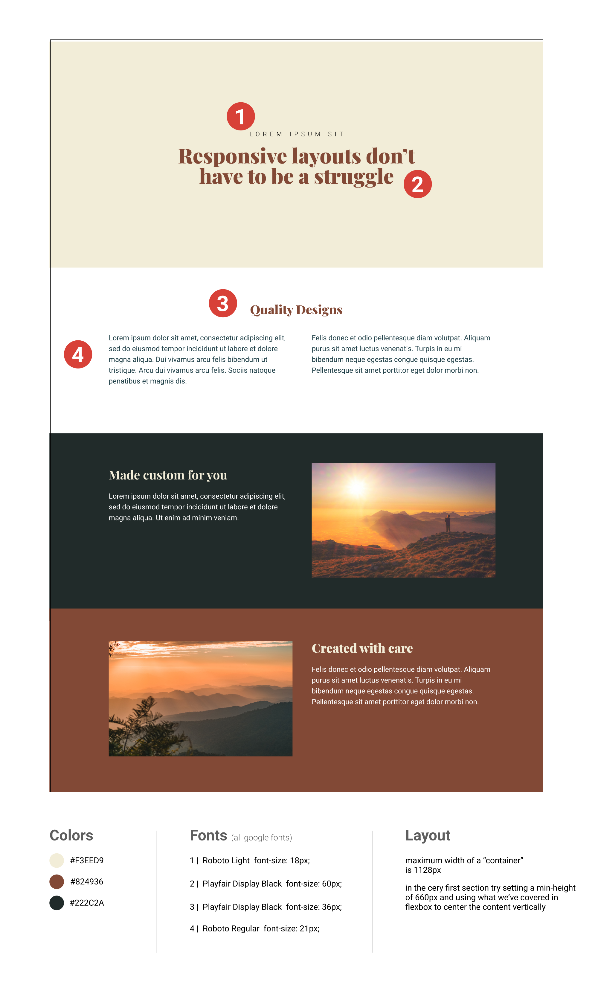

# Responsive Made Easy



## Welcome !!! 👋

### Intro

Responsive sites that focus on mobile-first design.

## Technologies Used

```
- HTML5
- CSS3
- Git
- GitHub
- Google Fonts
```

## Getting Started

```Clone Repo
git clone https://github.com/thenameiswiiwin/responsive-made-easy.git
```

```Change Directory
cd responsive-made-easy
```

### StyleLint and Prettier

```Run all scripts (lint: stylelint, prettier)
npm run lint
```

## Folders Architecture

```
.
│
├── assets/
│
├── css/
│ ├── components/
│ │ ├── \_1-variables.css
│ │ ├── \_2-variables.css
│ │ ├── \_3-global.css
│ │ ├── \_4-banner.css
│ │ ├── \_5-nav.css
│ │ ├── \_6-hero.css
│ ├── main.css
│
├── design/
│
├── .gitignore
├── .prettierrc.json
├── .stylelintrc.json
├── index.html
├── package.json
└── README.md
```
